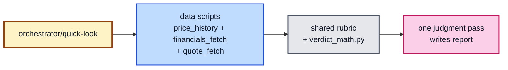
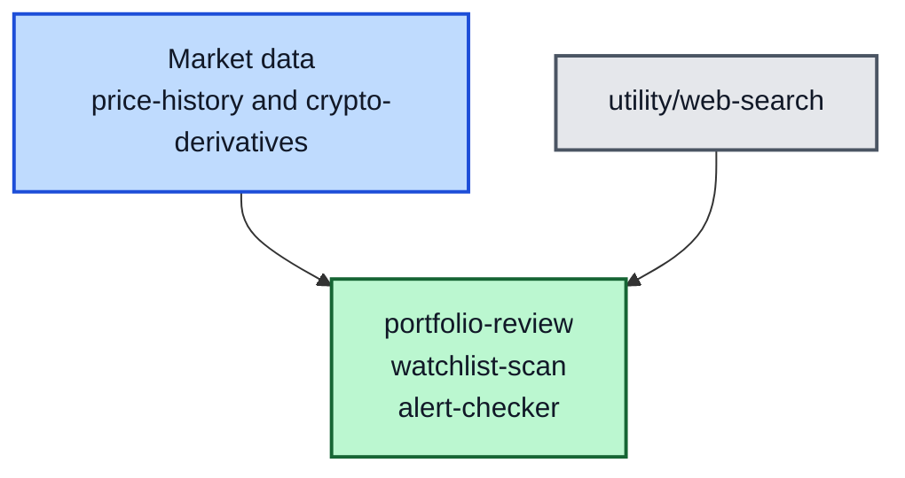

# Investment Skills Network

A library of composable Kiro skills for investment research across three markets: US equities, Bursa Malaysia, and Crypto. An agent invokes these skills on demand to produce structured research reports, from a two-minute quick-look to full due diligence.

## Skill map

The old graph tried to show every skill call at once. It was technically complete but hard to read. These three routes show how you use the system. The catalogue names every skill behind each route.

### Quick look

One orchestrator pass: detect the market, run three data scripts, one judgment pass writes the report. No analysis-skill reads.



### Deep research

A gate decides which factor packs a run actually needs. Factor packs fan out to parallel sub-agents, one fresh context each, via the harness's kanban/task queue when available.

```mermaid
flowchart LR
    DR[orchestrator/deep-research]:::orch --> DATA[Shared data pack<br/>statements + prices + quote]:::data --> GATE[analysis/quality-gate<br/>routes the run]:::analysis --> PACKS[Conditional factor packs<br/>technical, valuation, macro,<br/>sentiment, on-chain]:::analysis --> VERDICT[analysis/verdict-synthesis<br/>+ verdict_math.py]:::analysis --> REPORT[utility/report-writer]:::util

    classDef orch fill:#fef3c7,stroke:#92400e,stroke-width:3px,color:#111827
    classDef data fill:#bfdbfe,stroke:#1d4ed8,stroke-width:2px,color:#111827
    classDef analysis fill:#fbcfe8,stroke:#be185d,stroke-width:2px,color:#111827
    classDef util fill:#e5e7eb,stroke:#4b5563,stroke-width:2px,color:#111827
```



### Scheduled monitoring



### Skill catalogue

| Group | Skills |
|-------|--------|
| Research entry points | `orchestrator/quick-look`, `orchestrator/deep-research` |
| Scheduled monitors | `monitor/portfolio-review`, `monitor/watchlist-scan`, `monitor/alert-checker` |
| Shared data | `data/fundamentals` for US and Bursa financials, `data/price-history` for all markets |
| Quality gate | `analysis/quality-gate` - quick screen plus the buffett-based deep US valuation |
| Valuation baseline | `analysis/valuation-baseline` - quote-aware fair multiple (rates, growth, moat) for dispatch B |
| US pack | `data/us-macro`, `data/us-filings`; `analysis/us-technical`, `analysis/us-sentiment` |
| Bursa pack | `data/bursa-announcements`, `data/bursa-fundamentals`, `data/bursa-macro`; `analysis/bursa-valuation`, `analysis/bursa-technical`, `analysis/bursa-sentiment` |
| Crypto pack | `data/crypto-fundamentals`, `data/crypto-onchain`, `data/crypto-derivatives`, `data/crypto-macro`; `analysis/crypto-valuation`, `analysis/crypto-technical`, `analysis/crypto-onchain-analysis`, `analysis/crypto-sentiment` |
| Shared analysis and utilities | `analysis/macro-context`, `analysis/verdict-synthesis`; `utility/report-writer`, `utility/web-search`, `utility/cache-cleanup` |

`analysis/us-valuation` was removed: the quality gate's buffett dispatch B supplies the US valuation factor. Shared scoring lives in `utility/shared-lib` (`verdict_rubric.md`, `scripts/verdict_math.py`); shared ticker normalization and Bursa display names live in `utility/shared-lib/scripts/ticker_display.py` — files, not skills.

Yellow boxes are orchestrators, green boxes are monitors, blue boxes are data, pink boxes are analysis, and grey boxes are utilities.

## How it works

Skills are instructions for the Kiro agent, not standalone programs. The agent reads a `SKILL.md` to know what to do, invokes helper scripts when needed, and writes output to your notes directory.

**Data flow:**

1. Orchestrator detects market from ticker format
2. Shared data scripts fetch and write to scratch (intermediate files)
3. The quality gate screens the candidate and routes which factor packs run
4. Factor packs (parallel sub-agents) read scratch, produce judgments
5. Verdict synthesis labels the factors; verdict_math.py computes the Buy/Sell/Hold
6. Final report written to notes directory

## Project structure

```
src/
├── utility/              # Shared helpers
│   ├── report-writer/        # Output paths, report template
│   ├── web-search/           # When/how to use web search
│   ├── cache-cleanup/        # Prune stale cache files (default: older than 7 days)
│   └── shared-lib/           # yahoo_cache.py, ticker_display.py, quote cache, verdict_rubric.md, verdict_math.py
│
├── data/                 # Fetch and normalize (never interpret)
│   ├── fundamentals/         # US + Bursa financials + quote_fetch.py (multiples)
│   ├── price-history/        # OHLCV + indicators, all markets
│   ├── us-macro/             # Fed rates, yields, liquidity
│   ├── us-filings/           # SEC Form 4, 13F, 10-K/10-Q
│   ├── bursa-announcements/  # Insider transactions
│   ├── bursa-fundamentals/   # Market overview, fund flows
│   ├── bursa-macro/          # OPR, MYR, CPO
│   ├── crypto-fundamentals/  # Market cap, FDV, TVL, unlocks
│   ├── crypto-onchain/       # Exchange flows, whales, staking
│   ├── crypto-derivatives/   # Funding rates, OI, liquidations
│   └── crypto-macro/         # DXY, stablecoin supply, ETF flows
│
├── analysis/             # Interpret data, produce judgments
│   ├── quality-gate/         # Cheap screen + buffett deep US valuation
│   ├── valuation-baseline/   # Quote-aware fair multiple (rates, growth, moat)
│   ├── us-technical/         # Stage, RS, S/R, entry/stop
│   ├── us-sentiment/         # Insiders, institutions, news
│   ├── bursa-valuation/      # Dividend-focused, peer comparison
│   ├── bursa-technical/      # Weekly charts, volume confirmation
│   ├── bursa-sentiment/      # Bursa filings, The Edge
│   ├── crypto-valuation/     # Tokenomics, TVL, revenue
│   ├── crypto-technical/     # 24/7, funding, liquidation zones
│   ├── crypto-onchain-analysis/  # Accumulation/distribution
│   ├── crypto-sentiment/     # CT, governance, dev activity
│   ├── macro-context/        # Market-level backdrop
│   └── verdict-synthesis/    # Final Buy/Sell/Hold, math via verdict_math.py
│
├── orchestrator/         # End-to-end pipelines
│   ├── quick-look/           # Fast filter (2 min, one pass)
│   └── deep-research/        # Gate-routed pipeline (sub-agent fan-out)
│
└── monitor/              # Scheduled checks
    ├── portfolio-review/     # Weekly P&L, stop/target checks
    ├── watchlist-scan/       # Entry condition monitoring, gate_checks screening
    └── alert-checker/        # Custom per-position alerts
```

## Setup

### Environment variables

| Variable | Purpose | Default |
|----------|---------|---------|
| `ISK_ROOT` | Points to `src/`. Scripts use it to find shared libraries. | Falls back to `__file__`-relative resolution |
| `ISK_NOTES` | Base directory for all output (reports, scratch, portfolio). | `~/notes` |
| `ISK_CACHE` | Cache directory for Yahoo fetches (fallback-only for prices, daily for statements). | `~/.cache` |
| `ISK_PRICE_TTL_MINUTES` | Opt-in: serve the price/quote cache within this window instead of fetching live every run. | None (always live) |
| `ISK_CACHE_MAX_AGE_DAYS` | Retention window for `utility/cache-cleanup` (prunes cache files older than this). | 7 |
| `FRED_API_KEY` | FRED API for US macro data | None (us-macro reports "unavailable") |
| `SEC_EDGAR_USER_AGENT` | SEC EDGAR access for US filings | None (filings uses web search fallback) |
| `BURSAWHALE_CLIENT_ID` | BursaWhale API for insider data | None (announcements uses web search) |
| `BURSAWHALE_CLIENT_SECRET` | BursaWhale API authentication | None |

Only `ISK_ROOT` and `ISK_NOTES` affect the core workflow. The API keys unlock specific data sources. If unset, skills fall back to web search or report "unavailable."

Path resolution is deterministic — no reliance on the shell session:

- Run `python src/utility/shared-lib/scripts/isk_paths.py` for the resolved paths (orchestrators do this as their first step).
- `.env` in the workspace root is the **source of truth** for `ISK_NOTES`, `ISK_CACHE`, and `ISK_ROOT` — it overrides inherited environment variables. API keys follow the usual convention: real environment wins, `.env` is the fallback.
- Relative paths in `.env` (e.g. `ISK_NOTES=./.notes`) resolve against the workspace root, not the directory a script runs from.
- Unset paths default to `~/notes` and `~/.cache`.

### Setting up (bash/zsh)

```bash
export ISK_ROOT="/path/to/investment-skills/src"
export ISK_NOTES="$HOME/notes"             # default, change if you want output elsewhere
export ISK_CACHE="$HOME/.cache"            # default, change if you want output elsewhere
export FRED_API_KEY="your-key-here"        # optional
```

### Setting up (PowerShell)

```powershell
$env:ISK_ROOT = "C:\path\to\investment-skills\src"
$env:ISK_NOTES = "$env:USERPROFILE\notes"  # default, change if you want output elsewhere
$env:ISK_CACHE = "$env:USERPROFILE\.cache"  # default, change if you want output elsewhere
$env:FRED_API_KEY = "your-key-here"        # optional
```

### Python dependencies

```bash
pip install requests
```

Most scripts use only the standard library. The `requests` package is needed by `fed_liquidity.py`, `yield_curve.py`, and `bursawhale_api.py`.

## Notes directory

All output goes into the directory pointed to by `ISK_NOTES` (defaults to `~/notes`). The structure inside:

```
$ISK_NOTES/
├── YYYY-MM/
│   ├── YYYY-MM-DD-MSFT-quick-look.md              # Quick-look reports
│   ├── YYYY-MM-DD-BTC-USD-deep-research.md        # Deep-research reports
│   ├── YYYY-MM-DD-1155.KL-MAYBANK-quick-look.md   # Bursa reports use the display ticker
│   └── .scratch/
│       └── YYYY-MM-DD-1155.KL-MAYBANK/            # Intermediate per-skill outputs
│           ├── fundamentals.md
│           ├── price-history.md
│           ├── bursa-valuation.md
│           └── verdict-synthesis.md
│
├── portfolio/
│   ├── holdings.yaml                          # Your positions (you create this)
│   ├── reviews/YYYY-MM/
│   │   └── YYYY-MM-DD-portfolio-review.md
│   └── alerts/YYYY-MM/
│       └── YYYY-MM-DD-alerts.md              # Only when alerts fire
│
└── watchlist/
    ├── watchlist.yaml                         # Tickers you're watching (you create)
    └── scans/YYYY-MM/
        └── YYYY-MM-DD-watchlist-scan.md
```

### Ticker naming in reports and scratch dirs

Report titles, filenames, and scratch directory names use each ticker's **display ticker**:

- **Bursa Malaysia**: the numeric code plus `.KL` and the short company name, e.g. `1155.KL-MAYBANK`, `1023.KL-CIMB`, `1295.KL-PBB`. This keeps Bursa research legible — a bare `1155` is hard to scan.
- **US / Crypto**: the normalized symbol, e.g. `MSFT`, `AAPL`, `BTC-USD`, `ETH-USD` (note the slash becomes a dash).

The data scripts emit `display_ticker` in their JSON output; the orchestrators and report-writer use it for the title and filename. Bursa names come from the Yahoo Finance short name when it looks like a common name, falling back to a curated table of well-known codes (`src/utility/shared-lib/scripts/ticker_display.py`), and finally to the bare `1155.KL` code.

### Customizing the output location

Set `ISK_NOTES` to any directory you want:

```bash
# Example: put notes in a Dropbox-synced folder
export ISK_NOTES="$HOME/Dropbox/investment-notes"

# Example: keep it in the repo (gitignored)
export ISK_NOTES="/path/to/investment-skills/output"
```

If unset, everything goes to `~/notes`. The directory is created automatically on first write.

The scratch directory (`.scratch/`) holds intermediate outputs from each sub-skill. You can inspect these to trace how the agent reached its conclusion. They're kept alongside reports for auditability.

## Cache directory

The cache lives at `ISK_CACHE` (defaults to `~/.cache`). Files are written into a
**date-addressed layout** so every entry carries its birth date in its path:

```
$ISK_CACHE/
├── YYYY-MM/                                  # per-month bucket
│   └── YYYY-MM-DD-<TICKER>_<KIND>_<INT>_<PER>.json
└── .bursawhale_token.json                    # OAuth token (own TTL)
```

Example: `.cache/2026-09/2026-09-13-1155_price_1d_1y.json`.

Because the fetch date is in the path (not just the mtime), moving or backing up
the cache never makes a file look freshly fetched. See the cache policy in
`src/utility/shared-lib/scripts/yahoo_cache.py` (prices are fetched live every
run — the cache is a fallback served only on failure; statements are cached for
the local calendar day).

### Cache cleanup

`utility/cache-cleanup` prunes cache files older than a retention window (default
**7 days**, override with `ISK_CACHE_MAX_AGE_DAYS` or `--max-age-days`). Age is
decided from the path, so it is safe to run any time:

```bash
# Preview what would be removed (no deletion)
python src/utility/cache-cleanup/scripts/cleanup_cache.py --dry-run

# Prune files older than the retention window
python src/utility/cache-cleanup/scripts/cleanup_cache.py

# Custom window + include the bursawhale token
python src/utility/cache-cleanup/scripts/cleanup_cache.py --max-age-days 14 --include-token
```

Schedule it on the same cadence as your other maintenance (e.g. a weekly cron or
harness job alongside the monitor skills).

## Usage

Tell the agent which skill to run:

| Command | What it does |
|---------|-------------|
| "Run quick-look on MSFT" | Fast two-minute assessment |
| "Run deep-research on BTC/USD" | Full crypto due diligence |
| "Run deep-research on 1155" | Full Bursa research (Maybank) |
| "Run portfolio review" | Check all holdings vs stops/targets |
| "Run watchlist scan" | Check watchlist for entry conditions |
| "Run cache cleanup" | Prune cache files older than the retention window |
| "Run alert checker" | Evaluate custom alert conditions |

## Market detection

The system auto-detects market from ticker format:

| Pattern | Market | Examples |
|---------|--------|----------|
| Numeric or `.KL` suffix | Bursa Malaysia | `1155`, `5180.KL` |
| Contains `/` | Crypto | `BTC/USD`, `ETH/USD` |
| Alphabetic | US | `MSFT`, `AAPL`, `NVDA` |

## Monitoring setup

Monitors are triggered by your scheduler / agent harness (e.g. a Hermes cron entry) calling the monitor skill directly. There is no wrapper script: the scheduler invokes the skill, and the skill does its own precondition checks (does the holdings/watchlist file exist, is there anything to check) as its first step, then writes output.

Configure schedules in your harness. Suggested cadence:

- Portfolio review — weekly (e.g. Sunday morning); more often if crypto-heavy.
- Watchlist scan — daily to weekly.
- Alert check — daily (pre-market for equities), every 4-6 hours for crypto positions.

Set `ISK_NOTES` in the harness environment so the skills resolve the right base path for holdings/watchlist files and output.

## Testing

The `tests/` directory holds a regression suite that runs without any network or
LLM access, plus optional live headless runs of the real orchestrators.

### Offline contract tests (always run)

`tests/test_skill_contract.py` pins the wiring of the two orchestrators for all
three markets: every skill and script an orchestrator is documented to invoke
must exist on disk, and the orchestrator must still reference it. It also
verifies the path resolver honors `.env`. These are pure filesystem assertions
— fast and deterministic:

```bash
python -m unittest tests.test_skill_contract.py -v
```

### Live headless runs (opt-in)

`tests/test_skill_integration.py` actually runs each orchestrator in
non-interactive mode via your agent CLI, for every (mode × market) combination,
then asserts the report lands under the `.env`-resolved notes dir with the right
sections and market wiring. These call the real agent and fetch live data, so
they are opt-in:

```bash
# Run all six cases (quick-look + deep-research × US, Bursa, Crypto)
ISK_LIVE=1 python -m unittest tests.test_skill_integration.py -v

# Run a single market × mode pair (cheaper/faster)
ISK_LIVE=1 ISK_ONE_CASE=quick-look,US python -m unittest tests.test_skill_integration.py -v
```

A convenience runner wraps this and forces `ISK_LIVE` on:

```bash
python tests/run_live.py                       # all six
python tests/run_live.py deep-research,Crypto   # one case
```

Each live case invokes the agent headless (e.g. `cmdc -p "..." --skill src --yolo`),
so it needs an authenticated CLI session and a model budget. The deep-research
cases fan out to many sub-skills and take longer than quick-look.

### What the suite covers

- **quick-look** and **deep-research** run end-to-end for **US, Bursa, and Crypto**.
- Output respects `.env` (reports land under `ISK_NOTES`, never `~/notes`).
- Reports carry the mode's required sections and the correct market label.
- Deep-research reports include a quality-gate verdict (proving the downstream
  analysis wiring fired).
- The offline contract tests catch wiring regressions (a missing skill or a
  renamed script) cheaply, before any live run.

## Portfolio and watchlist files

Create these before using monitors.

**`$ISK_NOTES/portfolio/holdings.yaml`**

```yaml
positions:
  - ticker: MSFT
    market: US
    account: ibkr
    entry_date: 2024-01-15
    entry_price: 380.50
    shares: 50
    target: 450.00
    stop: 340.00
    thesis: "Cloud growth re-acceleration + AI monetization"
    alert_conditions:
      - "alert if RSI > 70"
      - "alert if price drops below 200 SMA"
```

**`$ISK_NOTES/watchlist/watchlist.yaml`**

```yaml
tickers:
  - ticker: NVDA
    market: US
    added_date: 2024-02-01
    added_price: 680.00
    entry_condition: "Buy on pullback to 50 SMA or breakout above $750 with volume"
    catalyst_date: 2024-05-22
    catalyst: "Q1 earnings"
```

## Design principles

- **Data fetches, analysis interprets.** Data skills never judge. Analysis skills never fetch. Swap data sources without rewriting analysis.
- **Always-fresh data, cache only as fallback.** Prices and quotes are fetched live every run; the cache serves only when the live fetch fails. Quarterly statements are cached daily — they cannot change intraday.
- **Quality gates before deep work.** The quality gate runs after the cheap data fetch and routes the run: factor packs a candidate does not need are never fetched. A gate FAIL never hard-stops a headless run — it proceeds on a capped speculative track (conviction capped at Medium) with the gate verdict stated in the report.
- **LLM judges, scripts compute.** The agent labels factors with strength words; `verdict_math.py` computes composite score, conviction, and applied weights. Arithmetic never goes through the LLM. Verdicts report Action, conviction, target, timeframe, and stop — no position sizing.
- **Partial data is OK.** If an API fails, the pipeline continues. Reports note their gaps.
- **Market-specific weighting.** Weights differ per market (dividend yield matters more for Bursa, on-chain more for crypto). The tables live in `utility/shared-lib/verdict_rubric.md`.
- **Traceability via script data.** Script-written data files are preserved in scratch, so any verdict stays auditable at near-zero token cost. The LLM writes only the final report — no per-skill LLM scratch.
- **Sub-agent fan-out for factor packs.** Deep-research runs each factor pack in a parallel sub-agent with one fresh context per pack, routed through the harness's kanban/task queue when one exists.
- **No embedded scheduling.** Monitors don't implement cron. Your scheduler / agent harness triggers the monitor skill directly. You control frequency.
- **Cross-platform.** All scripts are Python. Works on Linux, macOS, and Windows without modification.
