# Investment Skills Network

A library of composable Kiro skills for investment research across three markets: US equities, Bursa Malaysia, and Crypto. An agent invokes these skills on demand to produce structured research reports, from a two-minute quick-look to full due diligence.

## Skill map

```mermaid
graph TD
    %% Orchestrators (entry points)
    QL[orchestrator/quick-look]:::orch
    DR[orchestrator/deep-research]:::orch

    %% Monitors (entry points)
    PR[monitor/portfolio-review]:::mon
    WS[monitor/watchlist-scan]:::mon
    AC[monitor/alert-checker]:::mon

    %% Data layer
    FUN[data/fundamentals]:::data
    PH[data/price-history]:::data
    UM[data/us-macro]:::data
    UF[data/us-filings]:::data
    BA[data/bursa-announcements]:::data
    BF[data/bursa-fundamentals]:::data
    BM[data/bursa-macro]:::data
    CF[data/crypto-fundamentals]:::data
    CO[data/crypto-onchain]:::data
    CD[data/crypto-derivatives]:::data
    CM[data/crypto-macro]:::data

    %% Analysis layer
    UV[analysis/us-valuation]:::analysis
    UT[analysis/us-technical]:::analysis
    US[analysis/us-sentiment]:::analysis
    BV[analysis/bursa-valuation]:::analysis
    BT[analysis/bursa-technical]:::analysis
    BS[analysis/bursa-sentiment]:::analysis
    CV[analysis/crypto-valuation]:::analysis
    CT[analysis/crypto-technical]:::analysis
    COA[analysis/crypto-onchain-analysis]:::analysis
    CS[analysis/crypto-sentiment]:::analysis
    MC[analysis/macro-context]:::analysis
    VS[analysis/verdict-synthesis]:::analysis

    %% Utility
    RW[utility/report-writer]:::util
    WSR[utility/web-search]:::util

    %% Orchestrator connections
    QL --> FUN & PH
    QL --> UV & UT
    QL --> VS --> RW

    DR --> FUN & PH & UM & UF & BA & BF & BM & CF & CO & CD & CM
    DR --> UV & UT & US & BV & BT & BS & CV & CT & COA & CS & MC
    DR --> VS

    %% Analysis reads data
    UV --> FUN
    UT --> PH
    US --> UF & WSR
    BV --> FUN & BF
    BT --> PH
    BS --> BA & WSR
    CV --> CF
    CT --> PH & CD
    COA --> CO
    CS --> WSR
    MC --> UM & BM & CM

    %% Monitors
    PR --> PH
    WS --> PH & WSR
    AC --> PH & CD & WSR

    %% Styles
    classDef orch fill:#ff9,stroke:#b80,stroke-width:3px
    classDef mon fill:#cfc,stroke:#080,stroke-width:2px
    classDef data fill:#def,stroke:#48a
    classDef analysis fill:#fde,stroke:#a48
    classDef util fill:#eee,stroke:#888
```



**Legend:** Yellow = orchestrators (main entry points), Green = monitors (scheduled), Blue = data skills, Pink = analysis skills, Grey = utilities.

The two orchestrators are the primary skills you invoke for research. Monitors run on a schedule.

## How it works

Skills are instructions for the Kiro agent, not standalone programs. The agent reads a `SKILL.md` to know what to do, invokes helper scripts when needed, and writes output to your notes directory.

**Data flow:**

1. Orchestrator detects market from ticker format
2. Data skills fetch and write to scratch (intermediate files)
3. Analysis skills read scratch, produce judgments
4. Verdict synthesis combines all analysis into a Buy/Sell/Hold
5. Final report written to notes directory

## Project structure

```
src/
├── utility/              # Shared helpers
│   ├── report-writer/        # Output paths, report template
│   ├── web-search/           # When/how to use web search
│   └── shared-lib/           # yahoo_cache.py
│
├── data/                 # Fetch and normalize (never interpret)
│   ├── fundamentals/         # US + Bursa financials
│   ├── price-history/        # OHLCV + indicators, all markets
│   ├── us-macro/             # Fed rates, yields, liquidity
│   ├── us-filings/           # SEC Form 4, 13F, 10-K/10-Q
│   ├── bursa-announcements/  # Insider transactions
│   ├── bursa-fundamentals/   # Market overview, fund flows
│   ├── bursa-macro/          # OPR, MYR, CPO
│   ├── crypto-fundamentals/  # Market cap, FDV, TVL, unlocks
│   ├── crypto-onchain/       # Exchange flows, whales, staking
│   ├── crypto-derivatives/   # Funding rates, OI, liquidations
│   └── crypto-macro/         # DXY, stablecoin supply, ETF flows
│
├── analysis/             # Interpret data, produce judgments
│   ├── us-valuation/         # DCF, multiples, PEG, quality
│   ├── us-technical/         # Stage, RS, S/R, entry/stop
│   ├── us-sentiment/         # Insiders, institutions, news
│   ├── bursa-valuation/      # Dividend-focused, peer comparison
│   ├── bursa-technical/      # Weekly charts, volume confirmation
│   ├── bursa-sentiment/      # Bursa filings, The Edge
│   ├── crypto-valuation/     # Tokenomics, TVL, revenue
│   ├── crypto-technical/     # 24/7, funding, liquidation zones
│   ├── crypto-onchain-analysis/  # Accumulation/distribution
│   ├── crypto-sentiment/     # CT, governance, dev activity
│   ├── macro-context/        # Market-level backdrop
│   └── verdict-synthesis/    # Final Buy/Sell/Hold + sizing
│
├── orchestrator/         # End-to-end pipelines
│   ├── quick-look/           # Fast filter (2 min)
│   └── deep-research/        # Full pipeline (all skills)
│
└── monitor/              # Scheduled checks
    ├── portfolio-review/     # Weekly P&L, stop/target checks
    ├── watchlist-scan/       # Entry condition monitoring
    └── alert-checker/        # Custom per-position alerts
```

## Setup

### Environment variables

| Variable | Purpose | Default |
|----------|---------|---------|
| `ISK_ROOT` | Points to `src/`. Scripts use it to find shared libraries. | Falls back to `__file__`-relative resolution |
| `ISK_NOTES` | Base directory for all output (reports, scratch, portfolio). | `~/notes` |
| `FRED_API_KEY` | FRED API for US macro data | None (us-macro reports "unavailable") |
| `SEC_EDGAR_USER_AGENT` | SEC EDGAR access for US filings | None (filings uses web search fallback) |
| `BURSAWHALE_CLIENT_ID` | BursaWhale API for insider data | None (announcements uses web search) |
| `BURSAWHALE_CLIENT_SECRET` | BursaWhale API authentication | None |

Only `ISK_ROOT` and `ISK_NOTES` affect the core workflow. The API keys unlock specific data sources. If unset, skills fall back to web search or report "unavailable."

### Setting up (bash/zsh)

```bash
export ISK_ROOT="/path/to/investment-skills/src"
export ISK_NOTES="$HOME/notes"             # default, change if you want output elsewhere
export FRED_API_KEY="your-key-here"        # optional
```

### Setting up (PowerShell)

```powershell
$env:ISK_ROOT = "C:\path\to\investment-skills\src"
$env:ISK_NOTES = "$env:USERPROFILE\notes"  # default, change if you want output elsewhere
$env:FRED_API_KEY = "your-key-here"        # optional
```

### Python dependencies

```bash
pip install requests
```

Most scripts use only the standard library. The `requests` package is needed by `fed_liquidity.py`, `yield_curve.py`, and `bursawhale_api.py`.

## Notes directory

All output goes into the directory pointed to by `ISK_NOTES` (defaults to `~/notes`). The structure inside:

```
$ISK_NOTES/
├── YYYY-MM/
│   ├── YYYY-MM-DD-MSFT-quick-look.md         # Quick-look reports
│   ├── YYYY-MM-DD-BTC-deep-research.md       # Deep-research reports
│   └── .scratch/
│       └── YYYY-MM-DD-MSFT/                  # Intermediate per-skill outputs
│           ├── fundamentals.md
│           ├── price-history.md
│           ├── us-valuation.md
│           └── verdict-synthesis.md
│
├── portfolio/
│   ├── holdings.yaml                          # Your positions (you create this)
│   ├── reviews/YYYY-MM/
│   │   └── YYYY-MM-DD-portfolio-review.md
│   └── alerts/YYYY-MM/
│       └── YYYY-MM-DD-alerts.md              # Only when alerts fire
│
└── watchlist/
    ├── watchlist.yaml                         # Tickers you're watching (you create)
    └── scans/YYYY-MM/
        └── YYYY-MM-DD-watchlist-scan.md
```

### Customizing the output location

Set `ISK_NOTES` to any directory you want:

```bash
# Example: put notes in a Dropbox-synced folder
export ISK_NOTES="$HOME/Dropbox/investment-notes"

# Example: keep it in the repo (gitignored)
export ISK_NOTES="/path/to/investment-skills/output"
```

If unset, everything goes to `~/notes`. The directory is created automatically on first write.

The scratch directory (`.scratch/`) holds intermediate outputs from each sub-skill. You can inspect these to trace how the agent reached its conclusion. They're kept alongside reports for auditability.

## Usage

Tell the agent which skill to run:

| Command | What it does |
|---------|-------------|
| "Run quick-look on MSFT" | Fast two-minute assessment |
| "Run deep-research on BTC/USD" | Full crypto due diligence |
| "Run deep-research on 1155" | Full Bursa research (Maybank) |
| "Run portfolio review" | Check all holdings vs stops/targets |
| "Run watchlist scan" | Check watchlist for entry conditions |
| "Run alert checker" | Evaluate custom alert conditions |

## Market detection

The system auto-detects market from ticker format:

| Pattern | Market | Examples |
|---------|--------|----------|
| Numeric or `.KL` suffix | Bursa Malaysia | `1155`, `5180.KL` |
| Contains `/` | Crypto | `BTC/USD`, `ETH/USD` |
| Alphabetic | US | `MSFT`, `AAPL`, `NVDA` |

## Monitoring setup

Monitors are triggered by external cron or Task Scheduler. Each has a cross-platform Python helper script:

```bash
# Weekly portfolio review (Sunday 9 AM)
0 9 * * 0 python3 /path/to/src/monitor/portfolio-review/scripts/run_review.py

# Weekly watchlist scan (Sunday 10 AM)
0 10 * * 0 python3 /path/to/src/monitor/watchlist-scan/scripts/run_scan.py

# Daily alert check (8 AM, or every 4h for crypto)
0 8 * * * python3 /path/to/src/monitor/alert-checker/scripts/run_alerts.py
```

The scripts validate your environment, ensure output directories exist, and print the command to invoke the agent. They use `ISK_NOTES` to find holdings/watchlist files and write output.

## Portfolio and watchlist files

Create these before using monitors.

**`$ISK_NOTES/portfolio/holdings.yaml`**

```yaml
positions:
  - ticker: MSFT
    market: US
    account: ibkr
    entry_date: 2024-01-15
    entry_price: 380.50
    shares: 50
    target: 450.00
    stop: 340.00
    thesis: "Cloud growth re-acceleration + AI monetization"
    alert_conditions:
      - "alert if RSI > 70"
      - "alert if price drops below 200 SMA"
```

**`$ISK_NOTES/watchlist/watchlist.yaml`**

```yaml
tickers:
  - ticker: NVDA
    market: US
    added_date: 2024-02-01
    added_price: 680.00
    entry_condition: "Buy on pullback to 50 SMA or breakout above $750 with volume"
    catalyst_date: 2024-05-22
    catalyst: "Q1 earnings"
```

## Design principles

- **Data fetches, analysis interprets.** Data skills never judge. Analysis skills never fetch. Swap data sources without rewriting analysis.
- **Partial data is OK.** If an API fails, the pipeline continues. Reports note their gaps.
- **Market-specific weighting.** Verdict synthesis weighs factors differently per market: dividend yield matters more for Bursa, on-chain matters more for crypto.
- **Scratch for traceability.** Every sub-skill writes intermediate output. You can trace how the verdict was reached.
- **No embedded scheduling.** Monitors don't implement cron. External schedulers call helper scripts. You control frequency.
- **Cross-platform.** All scripts are Python. Works on Linux, macOS, and Windows without modification.
